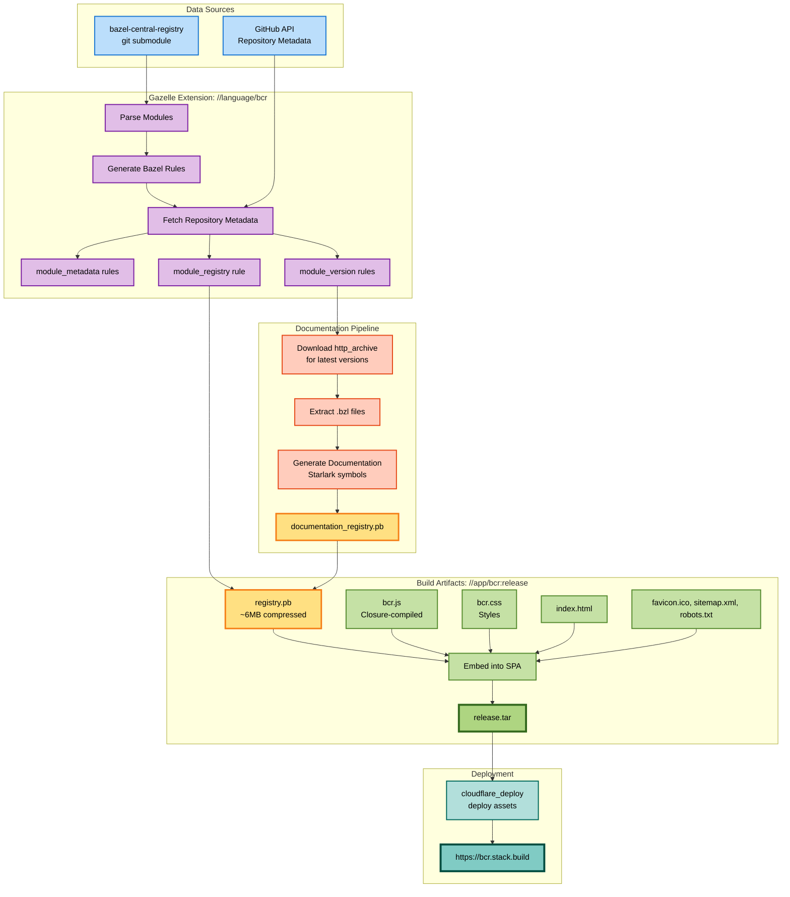

> [!IMPORTANT]
> This is a fork of the [bcr-frontend](https://github.com/bazel-contrib/bcr-frontend) repo, designed to index the
> [ROS Central Registry](https://github.com/intrinsic-opensource/ros-central-registry). If you are looking for the
> original upstream repo, please visit this link: https://github.com/bazel-contrib/bcr-frontend.


# bcr-frontend

This repository provides a web UI and API for the [Bazel Central Registry](https://github.com/bazelbuild/bazel-central-registry).

- A git submodule is located at `data/bazel-central-registry`.
- A custom gazelle extension `//language/bcr` walks the module tree under `data/bazel-central-registry/modules`, creating a set of build rules that represent the state of the registry.  The various modules and module versions are linked into a top-level `module_registry rule //data/bazel-central-registry/modules:modules`.  A makefile target `make bcr` can be run locally that checks out the most recent version of the submodule and runs the gazelle extension.
  - NOTE: `GITHUB_TOKEN` is required for fetching repository metadata during a
    gazelle run.
- A protobuf representation of the state of the BCR is constructed by `bazel build //data/bazel-central-registry/modules:modules`.  This includes downloading source repository archives for latest versions (that include starlark files) and extracting stardoc for them, outputting the file `bazel-bin/data/bazel-central-registry/modules/registry.pb`.
- `bazel run //app/bcr:release` builds the frontend single-page-application UI
  and embed the registry proto data in it, and starts a webserver for local development.
- `bazel //app/api` builds a rust->wasm app that runs as a cloudflare worker to service API requests.  The UI does not currently depend on the API; the primary purpose is to support shields.io-like badges (example: ).  The API also serves fragments of the `Registry` protobuf data.
- `bazel run //app/bcr:deploy` builds the UI and API and deploys it to cloudflare.

CI works as follows:

- When new commits land in `github.com/bazelbuild/bazel-central-registry`, a
  repository dispatch triggers `deploy-ghpages.yml`, which directly deploys
  to production without creating commits or PRs on main.
- A weekly cron job (`periodic-submodule-sync.yaml`) syncs the main branch's
  submodule reference to keep it reasonably current.
- A health check (`check-runner-health.yml`) runs every 6 hours on a
  GitHub-hosted runner to verify the self-hosted runner is online. If the runner
  is offline, it creates a GitHub issue with the `runner-offline` label and
  assigns `pcj`. Subsequent checks add comments to the existing issue. When the
  runner comes back online, the issue is automatically closed.

### Manual Deployment

To manually deploy a specific BCR commit:

```sh
gh workflow run deploy-ghpages.yml -f bcr_commit=<sha>
```

To deploy the latest BCR commit:

```sh
gh workflow run deploy-ghpages.yml
```

## Linux Prerequisites for Production Builds

Production builds (`--//app/bcr:release_type=production`) pre-render the home
page via a hermetic `chrome-headless-shell` provided by
[rules_browsers](https://github.com/angular/rules_browsers). Bazel downloads
the browser binary itself, but on Linux the binary is dynamically linked
against several system shared libraries that aren't installed by default on
minimal images (self-hosted CI runners, containers, etc.).

Symptom — production build fails with something like:

```
chrome failed to start: ... libasound.so.2: cannot open shared object file
```

One-time fix on the host (Debian/Ubuntu):

```sh
sudo apt-get update
# libasound2 was renamed to libasound2t64 on Ubuntu 24.04+
LIBASOUND=$(apt-cache show libasound2t64 >/dev/null 2>&1 && echo libasound2t64 || echo libasound2)
sudo apt-get install -y \
  $LIBASOUND \
  libatk-bridge2.0-0 libatk1.0-0 \
  libcairo2 libcups2 \
  libdbus-1-3 libdrm2 \
  libgbm1 libglib2.0-0 \
  libnspr4 libnss3 \
  libpango-1.0-0 \
  libx11-6 libxcb1 libxcomposite1 libxdamage1 libxext6 libxfixes3 \
  libxkbcommon0 libxrandr2 libxshmfence1
```

Debug and dummy builds (the default `release_type=debug`, and
`release_type=dummy`) skip prerendering and do not require these packages.

## Build Pipeline



## Maintenance and Support

This repo is funded by contributions to our
[OpenCollective](https://opencollective.com/bazel-rules-authors-sig/projects/bazel-central-registry).
Maintenance is performed on a best-effort basis by volunteers in the Bazel
community.

## Contributing

We are happy about any contributions!

To get started you can take a look at our [Github
issues](https://github.com/bazel-contrib/bcr-frontend/issues).

Unless you explicitly state otherwise, any contribution intentionally submitted
for inclusion in the work by you, as defined in the Apache-2.0 license, shall be
licensed as below, without any additional terms or conditions.

## Quick Start

Have a `GITHUB_TOKEN` available (for rate limit increases):

```sh
$ export GITHUB_TOKEN=ghp_...
```

Step 1: initialize (or update) the bcr submodule:

```sh
$ make bcr_init
$ make bcr_update
```

Step 2: run the gazelle extension over it (with GITHUB_TOKEN):

```sh
$ bazel run bcr
```

Step 3: build and run a development server over the release assets (consider `ibazel` for iterative development):

```sh
$ bazel run //app/bcr:release
...
releaseserver: Starting server on http://localhost:8080
releaseserver: Press Ctrl+C to stop
```
